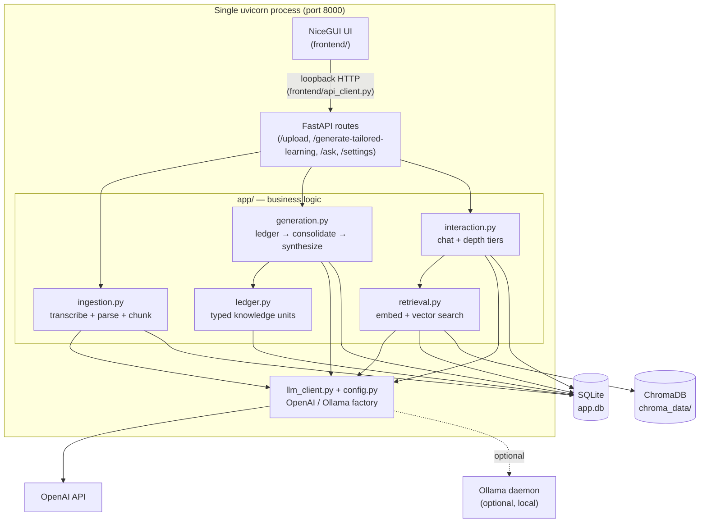

# Architecture

This document is the **map** of Socratic AI: what every file is, how data is shaped, and how the
pieces fit. For the exact call-by-call runtime trace see [`docs/pipeline.md`](docs/pipeline.md). For
*why* the major decisions were made (and their known trade-offs), see [`docs/adr/`](docs/adr/). For
how to run, test, and contribute, see [`AGENTS.md`](AGENTS.md).

---

## 1. What it is

Socratic AI turns videos and documents into a structured **learning pack** (per-source deep dives,
cross-source synthesis, a quiz) plus a **Socratic chat** grounded in the uploaded material. It runs
as **one uvicorn process**: a FastAPI backend with a NiceGUI UI mounted on the same app. Storage is
local: SQLite for structured data, ChromaDB for vector retrieval. The LLM backend is pluggable
(OpenAI by default, Ollama optional, switchable at runtime).

## 2. System diagram

**Pipeline at a glance:** `Ingest → Generate → Chat`. A 2-source run is ~11 LLM calls on
`gpt-4o-mini` (~$0.01); results are cached so reopening a session is free.

## 3. File-by-file catalog

Line counts are approximate (current as of this writing).

### Entry points / config (root)
| Path | LOC | Purpose |
|---|---|---|
| `run.py` | 41 | Launcher: starts one uvicorn server (`main:app`), opens the browser. `uv run socratic-ai` → `run:main`. |
| `main.py` | 49 | Builds the FastAPI app, includes routers, runs DB table init on `startup`, then mounts the NiceGUI UI via `ui.run_with`. |
| `config.py` | 307 | Settings dataclass (runtime-switchable provider/model/key) + static infra constants; LLM client cache (`get_llm_client`/`get_aux_client`); thread-safe `apply_settings`; SQLite engine + Chroma client; startup checks. |
| `pyproject.toml` | — | Project metadata, deps, `socratic-ai` entry point, pytest config (asyncio mode, `e2e` marker). |
| `.env.example` | — | Bootstrap env vars (keys, provider/model defaults). Runtime changes go through the Settings panel. |

### `app/` — backend business logic
| Path | LOC | Purpose |
|---|---|---|
| `app/ingestion.py` | ~990 | Upload handling. Video: ffmpeg audio extract → Whisper transcription (chunked >24 MB) or yt-dlp download for YouTube URLs. Docs: PyMuPDF (PDF) / raw read (`.txt`/`.md`). Text → overlapping `source_text_chunks` (carries timestamps/page numbers). Schedules background embedding at ingest. Owns `sources`, `source_text_chunks`. |
| `app/generation.py` | ~1050 | The pipeline orchestrator — parallel by default (`_run_parallel`, global 8-call semaphore). Per source (all sources concurrent): parallel map-reduce ledger extraction (aux model + code dedup merge) → consolidation (main model) → code validation → optional one re-gen. Enrichment: insights ∥ quiz focused calls (cross-source or single-source). Two-level cache via `GENERATION_SCHEMA_VERSION`/`LEDGER_SCHEMA_VERSION`. Owns `source_learning_sections`, `combined_learning_sections`. |
| `app/section_validator.py` | ~95 | Pure-code section validation (sentence/item budgets + restatement overlap) — replaced the LLM audit pass. |
| `app/ledger.py` | 220 | The `KnowledgeUnit` model (typed, source-grounded atomic claims) + dedup (0.72 token-overlap), render-for-prompt, parse, and persistence (`source_ledger_units`, `LEDGER_SCHEMA_VERSION`). |
| `app/interaction.py` | ~380 | Socratic chat. Heuristic depth tier (lookup/explain/analyze/deepen in code — no LLM call; scales context+top_k) → retrieval + generated-learning context → grounded answer (one LLM call per turn). Session turns persisted in `interaction_sessions`. |
| `app/retrieval.py` | 296 | ChromaDB retrieval: lazily embeds raw chunks into one collection, queries top-k with a score floor + dedup, formats provenance-tagged context. |
| `app/llm_client.py` | 237 | Provider abstraction: `OpenAIClient` / `OllamaClient` behind a common `chat_json`/`embed`/`transcribe` protocol. `build_client` wires keys/host from settings. |
| `app/models.py` | 194 | All Pydantic request/response/storage models (ingestion records, `SourceLearningSection`, `QuizQuestion`, `InsightIntersection`, `ApplicationScenario`, etc.). |
| `app/cost_logging.py` | 201 | Per-call token/cost logging + per-stage generation telemetry to SQLite. |
| `app/session_logger.py` | 104 | Per-run structured logging context (`session_log`) used by generation. |
| `app/json_reliability.py` | 49 | Defensive JSON parsing for LLM output (`parse_json_object`, `safe_json_loads`). |
| `app/auth.py` | 12 | Extracts the user id from the `X-User-ID` header (single-user local default `local`). |

### `routes/` — FastAPI endpoints (thin; validation + error mapping only)
| Path | LOC | Purpose |
|---|---|---|
| `routes/upload.py` | 39 | `POST /upload` → `ingest_upload_bundle`. |
| `routes/workflow.py` | 44 | `POST /generate-tailored-learning` → `generate_tailored_learning`; maps `GenerationStageError` to 422 with run/stage detail. |
| `routes/interaction.py` | 32 | `POST /ask` → `handle_user_query`. |
| `routes/settings.py` | 117 | `GET /settings` (key masked), `PUT /settings` (apply at runtime), `GET /settings/test` (provider probe). |

### `prompts/` — LLM contracts
| Path | LOC | Purpose |
|---|---|---|
| `prompts/__init__.py` | 437 | System prompts + JSON schemas for every stage (ledger extraction, consolidation, synthesis, audit, chat, depth classifier) and chat helpers (`build_chat_system_prompt`, `chat_context_scale`). |
| `prompts/sections.py` | 162 | Declarative `SectionSpec` registry: the cognitive arc (role, consumed ledger types, non-overlap rule, length budget, audit rules) for per-source and cross-source sections. |

### `frontend/` — NiceGUI UI
| Path | LOC | Purpose |
|---|---|---|
| `frontend/ui.py` | 52 | Defines the `/` and `/settings` pages, theme, header; called once from `main.py`. |
| `frontend/state.py` | 69 | Per-tab/per-user state on NiceGUI storage (`app.storage.tab`/`.user`); defaults, fresh-copy, reset. |
| `frontend/api_client.py` | 132 | Async loopback HTTP client to the backend (upload/generate/ask/settings). |
| `frontend/format.py` | 599 | Prose rendering, collapsible sections, attribution, Markdown/PDF export helpers. |
| `frontend/pages/build.py` | 227 | Two-step source-input wizard (video then docs) + Generate; renders the dashboard when ready. |
| `frontend/pages/dashboard.py` | 84 | Lays out the learning pack sections. |
| `frontend/pages/chat.py` | 146 | Socratic chat UI, message history, quiz-mode handoff. |
| `frontend/pages/settings.py` | 94 | Provider/model/key panel, Ollama test, Apply/Reset. |
| `frontend/components/learning_section.py` | 134 | Renders a section: prose + collapsible layman/technical key concepts. |
| `frontend/components/quiz.py` | 126 | Interactive multiple-choice quiz (lock on first pick, per-option feedback, chat seed). |
| `frontend/components/export.py` | 35 | PDF/Markdown export buttons. |

### `scripts/` — diagnostics & validation (not shipped at runtime)
See [`scripts/README.md`](scripts/README.md). Tools: `validate_pipeline.py` (E2E contract validation),
`run_diagnostic.py` (replay/inspect from DB), `checks.py` (assertion suite), `regression_suite.py`
(offline quality metrics), `diagnostic_compare.py` (run-to-run deltas). (`evaluate_redundancy.py` was
deleted — it queried a table that no longer exists.)

### `tests/` — pytest suite (~1,379 LOC)
Smoke (`test_pipeline_smoke.py`), cassette-backed E2E (`test_e2e_pipeline.py` + `_recording_client.py`),
generation quality, UI render, settings API, ingestion timeouts, JSON reliability, optional source modes.

### `docs/`
- `docs/pipeline.md` — exact runtime trace.
- `docs/adr/` — Architecture Decision Records.
- `docs/history/` — superseded planning docs, kept for provenance only.

## 4. Data model

### SQLite tables (`app.db`)
| Table | Owner | Key columns | Role |
|---|---|---|---|
| `sources` | ingestion | `id, user_id, source_type, filename` | One row per ingested source. |
| `source_text_chunks` | ingestion | `user_id, source_id, chunk_index, chunk_type, chunk_text, timestamp/page` | Overlapping ~2400-char chunks; the unit fed to both generation and retrieval. (The old write-only `transcripts`/`document_pages` tables are no longer created or written.) |
| `source_ledger_units` | ledger | `user_id, source_id, schema_version, units_json` | Cached extracted `KnowledgeUnit`s per source (`LEDGER_SCHEMA_VERSION`). |
| `source_learning_sections` | generation | `user_id, source_id, …, schema_version` | Cached consolidated per-source learning pack. |
| `combined_learning_sections` | generation | `user_id, video_source_id, document_source_ids_json, …` | Cached cross-source synthesis + quiz. |
| `interaction_sessions` | interaction | `session_id, user_id, state_json` | Chat session turns. |
| cost/telemetry tables | cost_logging | — | Per-call usage + per-stage generation events. |

### ChromaDB (`chroma_data/`)
One collection (`interaction_retrieval_concepts`) of raw-chunk embeddings, tagged with
`source_id`/`user_id`/`chunk_type`. Embeddings are upserted lazily on the first `/ask` for a source set.

### Key Pydantic models (`app/models.py`)
`SourceLearningSection` (summary, deep_dive, key_terms + `KeyTermExplanation`, under_surface,
`ReflectionPoint`s), `CombinedInsightSection` (key_takeaways, synthesis, `InsightIntersection`s,
`ApplicationScenario`s), `CombinedQuizSection` (`QuizQuestion`s with per-option explanations),
`KnowledgeUnit` (`app/ledger.py`), and the ingestion/ask request-response models.

## 5. State management

The UI is stateless on the server beyond NiceGUI storage:
- `app.storage.tab` — per-browser-tab builder/chat/generation state (see `_TAB_DEFAULTS` in
  `frontend/state.py`): `video_source`/`document_sources` (JSON-safe `{name, source_id}` refs),
  `generation_result`, `session_id`, `ask_messages`, `quiz_selected`, etc. Replaces Streamlit's
  `session_state`.
- `app.storage.user` — the user id across tabs (`local` for the single-user app).

**Everything in tab storage must be JSON-serializable.** NiceGUI serializes tab storage on reconnect,
so files are uploaded to the backend the moment they're added (`frontend/pages/build.py` →
`api_client.upload_*`) and only their `{name, source_id}` reference is kept — raw bytes are never
stored. Storing bytes there used to crash serialization on a websocket reconnect (alt-tab), wiping the
page back to the start.

The frontend talks to the backend over **loopback HTTP** (`frontend/api_client.py`), not direct
imports, so the routes' validation/auth/error-mapping apply uniformly. Because the UI websocket and the
API share one process, the slow synchronous handlers (`/generate-tailored-learning`, `/ask`) run via
`run_in_threadpool` so they never freeze the event loop (which would drop the UI as "not connected").
Durable state lives in SQLite + ChromaDB; the pipeline is idempotent via caching.

## 6. Config surface (`config.py`)

**Runtime-switchable** (via Settings panel / `PUT /settings`, persisted to the user config dir):
`llm_provider`, `embedding_provider`, `whisper_provider`, `ollama_host`, `openai_api_key`,
`generation_model`, `chat_model`, `retrieval_model`, and the aux group (`aux_use_local`,
`aux_llm_provider`, `aux_model`, `aux_local_model`). `apply_settings` swaps these under a lock and
invalidates the client cache.

**Static at startup** (env only): `DATABASE_URL`, `CHROMA_PERSIST_DIR`, `CACHE_PROCESSED_SOURCES`,
Whisper timeouts/retries, cost-logging toggle, `USER_ID_HEADER`.

## 7. Known issues / backlog

These are documented honestly; they are **not yet fixed**. Verify line references against current
source before acting — see the matching ADRs for context.

| Issue | Where | First-principles critique | Pragmatic fix | Priority |
|---|---|---|---|---|
| Aux model split buys little by default | `config.py`, `generation.py` | `aux_model` defaults to `generation_model` (`gpt-4o-mini`), so the "cheap aux pass" only differs when `aux_use_local` routes to Ollama. The abstraction has cost with no default benefit. | Set a genuinely cheaper hosted aux default, or document that aux only matters with local routing. See [ADR-0003](docs/adr/0003-dual-model-aux-routing.md). | Medium (design clarity) |
| Cache version has no changelog | `generation.py` `GENERATION_SCHEMA_VERSION=15` | A blunt full cache-bust with no record of what each bump changed; "15" implies many prior breaks with no history. | Maintain a version→change map. See [ADR-0004](docs/adr/0004-cache-via-schema-version.md). | Low |
| Runtime provider switch not proven end-to-end | `routes/settings.py`, `config.py` | `test_settings_api.py` covers the API, but no test asserts a switched provider/model is actually used by a subsequent generation/chat (e.g. `model_name` in the response). | Add an integration test that switches provider then asserts downstream `model_name`. | Low/Medium |

### Recently resolved

- **Mini-model orchestration redesign (v2.2)** — ledger extraction is parallel map-reduce
  ([ADR-0008](docs/adr/0008-map-reduce-ledger.md)); sources build concurrently; the LLM audit and the
  chat depth classifier were replaced by code ([ADR-0009](docs/adr/0009-code-validator-and-heuristic-tier.md));
  insights and quiz are two focused parallel calls; chunks embed at ingest. Net: a fresh run collapses
  from N serial round-trips to ~4, chat is one call per turn, and the quadratic prior-ledger token
  re-send is gone.
- **Single documents now get full enrichment** — a lone source produces a quiz, apply-it scenarios,
  takeaways, and a bigger-picture synthesis (`generation.py:_generate_single_source_deepening`), instead
  of empty insights/quiz. See [ADR-0007](docs/adr/0007-single-source-enrichment.md). Application
  scenarios are now rendered (they were generated but never shown).
- **Upload reliability** — files upload on add and only `{name, source_id}` refs live in tab storage
  (no bytes), the slow handlers run in a threadpool, and each upload refreshes only a *nested* section
  (not the whole page) so the live uploader element is never destroyed mid-upload. Together these fix
  the "alt-tab resets the page / not connected / can't add documents" failures. The source-input flow
  is the two-step upload→Next wizard.
- **Intersection grounding now checks existence, not just count** — `generation.py:_ground_intersections`
  drops attributed sentences citing a `source_id` that wasn't loaded for the run, then requires ≥2
  distinct *real* sources (covered by `tests/test_generation_quality.py::GroundIntersectionsTests`).
  See [ADR-0005](docs/adr/0005-cross-source-grounding.md).
- **Sentence-aware chat-context truncation** — `interaction.py:_truncate_text` now keeps whole sentences
  up to the budget instead of cutting mid-clause (covered by `…::TruncateTextTests`).
- **E2E cassette repaired** — `tests/test_e2e_pipeline.py` referenced a removed field and the cassette
  only intercepted the bare `openai_client` (so it silently hit the live API). The recording client now
  also intercepts the `get_llm_client`/`get_aux_client` wrapper path, and the cassette was re-recorded
  against the current schema; the test replays offline and deterministically.
- **Whisper timeout note corrected** — the timeout **is** applied (`ingestion.py` passes
  `timeout=WHISPER_TRANSCRIPTION_TIMEOUT_SECONDS`); an earlier audit note claiming otherwise was wrong.
