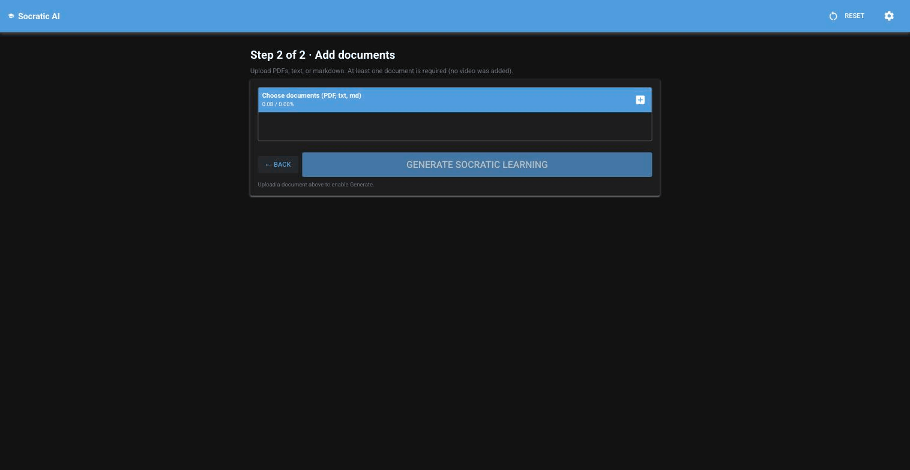

# Socratic AI

> *Sapere aude.* Dare to know. (Kant)

Give it a lecture recording and a few PDFs. It gives back the questions that find where your understanding stops, and a chat that only argues from your own material. Runs entirely on your Mac.



[](https://github.com/arturgrochau/socratic-ai/releases/latest)
[](https://github.com/arturgrochau/socratic-ai/actions/workflows/ci.yml)
[](LICENSE)


## What it does

You add a video (a YouTube link or a file) and any PDFs or notes. Socratic AI transcribes the video on your machine, reads the documents, and writes a learning pack for each source: a summary, a deep dive into the mechanisms, the key terms explained twice (once plainly, once precisely), the assumptions the source never states, and a set of reflection questions. With two or more sources it also writes what connects them, where they disagree, and a quiz. Then you can ask it anything, and every answer is grounded in your files.

I built it because pasting a lecture into a chatbot and reading the summary feels like learning and is not. You consumed an output. This tool does the opposite: it does not summarize your sources so you can skip them, it uses them to generate the questions you cannot yet answer. That friction is the product.

What it is not: a summarizer (ChatGPT does that in one prompt), a tutor with a curriculum, or a way around doing the reading. The reflection questions are useless if you skim them.

## Install on a Mac

1. Download `SocraticAI-3.0.0-macos-arm64.zip` from the [latest release](https://github.com/arturgrochau/socratic-ai/releases/latest) and unzip it.
2. Move `Socratic AI.app` to Applications and open it. The first launch shows a setup page: pick "On this Mac" and it checks for [Ollama](https://ollama.com/download), downloads a model that fits your memory, and tells you if `ffmpeg` is missing (only needed for video).

The app is signed with an ad-hoc signature, so macOS will say it cannot verify the developer. Right-click the app, choose Open, then Open again in the dialog. Or from a terminal: `xattr -dr com.apple.quarantine "/Applications/Socratic AI.app"`.

Needs Apple Silicon and macOS 14 or newer. 16 GB of memory is comfortable for the default local model; 8 GB works with the smallest one or with the Cloud API.

### Terminal, Linux, Windows, Intel Macs

```bash
curl -LsSf https://astral.sh/uv/install.sh | sh        # uv manages Python for you
brew install ollama ffmpeg                             # or https://ollama.com/download
git clone https://github.com/arturgrochau/socratic-ai.git && cd socratic-ai
uv run socratic-ai                                     # opens http://localhost:8000
```

On Apple Silicon, `uv sync --extra local` adds on-device transcription; elsewhere set transcription to OpenAI or `none` in Settings. `uv run socratic-ai-app` opens the native window instead of a browser tab (needs `uv sync --extra app`).

## Local or cloud

| | On this Mac (default) | Cloud API |
|---|---|---|
| Cost | Free | About $0.01 per pack on gpt-4o-mini |
| Privacy | Nothing leaves the machine ([PRIVACY.md](PRIVACY.md)) | Your text goes to the provider you pick |
| Needs | Ollama, 8 GB+ memory | An API key |
| Models | qwen3 4b / 8b / 14b / 30b-a3b, chosen by RAM | OpenAI, or any OpenAI-compatible URL: OpenRouter, Groq, DeepSeek, LM Studio |
| Transcription | parakeet-mlx on device | Whisper API |

Switch any time with the toggle in Settings. Each mode keeps its own model choices.

## How it works

```
 ┌──────────┐    ┌───────────────────┐    ┌────────┐
 │ Ingest   │───▶│ Generate          │───▶│ Chat   │
 │ Whisper  │    │ accumulate +      │    │ on top │
 │ + PDFs   │    │ consolidate + sx  │    │ of all │
 └──────────┘    └───────────────────┘    └────────┘
   per source    parallel map-reduce        1 call /Q
                  + 1 cross-source
```

Each source is split into chunks and walked in windows. Every model call sees the analysis accumulated so far and is told not to repeat it, then one consolidation call structures the result:

| Section | What it covers |
|---|---|
| Summary | Core arguments and narrative arc |
| Deep dive | Mechanisms, constraints, failure modes, edge cases |
| Key concepts | Each term with a plain explanation and a precise technical one |
| Under the surface | Hidden assumptions and the things most explanations skip |
| Reflection points | Questions tuned to find where your understanding runs out |

With more than one source, a cross-source pass adds a synthesis, the places the sources reinforce or contradict each other, application scenarios, and a multiple-choice quiz that hands you into the chat when you miss one. The chat retrieves from a local vector store (ChromaDB) over your sources and answers in one call per question, streamed.

A two-source session is about 12 model calls in 4 parallel waves. Results are cached per source and per model, so reopening a session costs nothing.

## Compared with

NotebookLM and [Open Notebook](https://github.com/lfnovo/open-notebook) are the closest tools. Both are built around asking questions of your sources and getting answers, plus summaries and audio overviews. Socratic AI is narrower and pointed the other way: it generates the questions, ranks them by how deep they cut, and treats the chat as a place to defend your answers rather than receive them. It also runs as a single Mac app with no Docker, no accounts, and a model picked for your hardware. If you want summaries and podcasts, use those; if you want to be examined on what you just watched, use this.

## Documentation

- [Tutorial](docs/TUTORIAL.md): install to first quiz, step by step, with screenshots.
- [CHANGELOG.md](CHANGELOG.md): what changed in each version.
- [ARCHITECTURE.md](ARCHITECTURE.md), [docs/pipeline.md](docs/pipeline.md), [docs/adr/](docs/adr/): how it is built and why.
- [AGENTS.md](AGENTS.md): how to work in this repo (also linked as `CLAUDE.md`).
- [CONTRIBUTING.md](CONTRIBUTING.md), [PRIVACY.md](PRIVACY.md), [TERMS.md](TERMS.md), [SECURITY.md](SECURITY.md).

## License

MIT. Copyright 2026 Artur Grochau.
